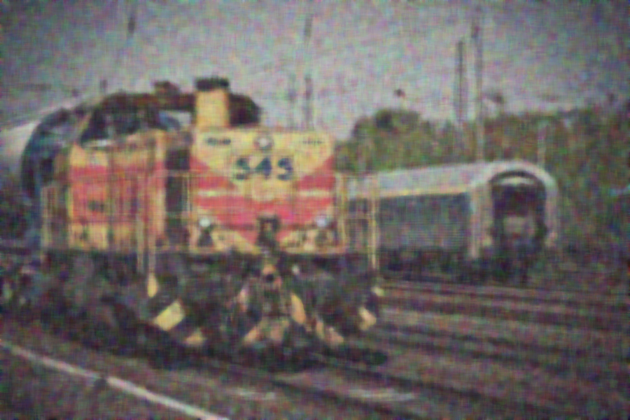

# Image Noise Reduction

Used OpenCV to remove noise from an image. Used median blur and gaussian blur method for noise reduction.

## Results

### Original Image

### Median Blur Method

### Gaussian Blur Method

